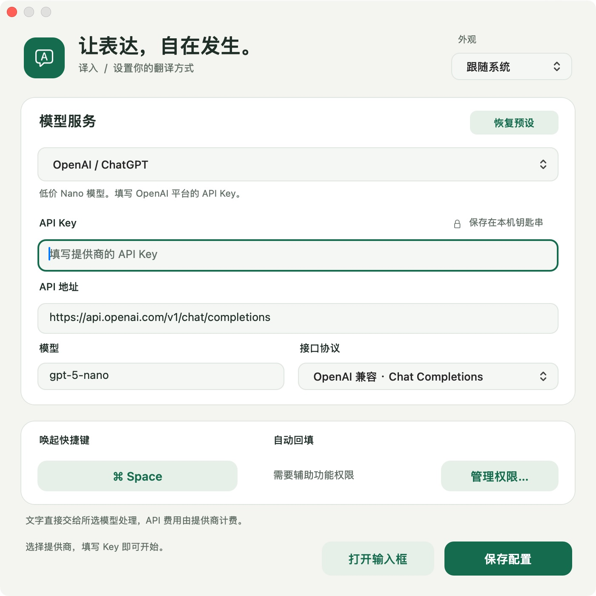

# 0.3 界面设计与检查记录

日期：2026-10-03。环境：macOS 15.1.1，Retina，原生 AppKit。

## 设计方向

输入内容优先。以暖白、墨色、翡翠绿构建层级，设置页按模型服务与使用偏好分组，输入和结果窗口采用一致的卡片、按钮与状态样式。支持跟随系统、浅色、深色三种外观。

采用系统字体、SF Symbols 和 AppKit 控件，保留原生文本选择、输入法、菜单和键盘操作。界面品质检查参考视觉清晰度、交互和功能执行等维度，见 [Webby 官方评审说明](https://www.webbyawards.com/judging-criteria/)。

## 三轮改进

| 轮次 | 发现 | 改进 |
| --- | --- | --- |
| 1 · 层级与布局 | 原窗口标题重复，操作区分散，设置字段挤在同一平面 | 统一标题与品牌标记；区分原文、目标语言、主操作；设置分组 |
| 2 · 状态与可读性 | 方形焦点框与圆角不一致，空输入按钮偏淡，中文多行偏紧 | 圆角焦点框、清晰的禁用态、正文行距；统一译文窗口；深色适配 |
| 3 · 交互与审查 | 字段边缘不聚焦，进入设置再返回会丢失原回填目标；浅色辅助文字对比度偏低 | 补齐点击区域；保留设置返回的原目标并继续执行最终校验；加深辅助文字 |

最终对比度按 sRGB 相对亮度计算：浅色辅助文字/底色约 4.98:1，浅色主按钮约 6.48:1，深色辅助文字/卡片约 6.77:1，深色主按钮约 7.82:1。这些是指定配色的检查结果；VoiceOver 和完整键盘导航另列人工验收。

## 实际检查

- 输入、设置、结果窗口分别检查浅色与深色画面。
- 多行中文输入与字数显示；空输入禁用提交；10,001 个 Unicode 标量禁用提交；短文本恢复后可操作。
- 字段和下拉选择框边缘点击；API 地址到模型的 Tab 顺序；初始与切换后的焦点框。
- Claude 地址、模型、协议预设；缺少 Key 保存错误；快捷键录制与 Esc 取消；保留已有组合。
- 从输入框切到设置，返回后原文保留。
- 生产译文窗口通过离线宿主检查浅色/深色、复制反馈、Esc 关闭。
- 独立代码审查发现的两项问题已修复，针对性复审通过。
- 10 组核心检查、22 个 HTTP 场景、Release 构建及严格签名验证通过。

真实模型翻译、辅助功能授权后的跨应用回填、输入法候选以及多屏场景继续按 [人工验收表](manual-testing.md) 跟踪。

## 截图





## 复现译文窗口检查

```bash
./scripts/build-ui-review.sh
open dist/UIReview.app
```

UIReview 使用独立应用标识，直接编译生产的配色、文本控件和结果窗口，显示固定样例。`Command + D` 切换外观，`Command + Return` 复制译文，`Esc` 关闭窗口，`Command + Q` 退出。
